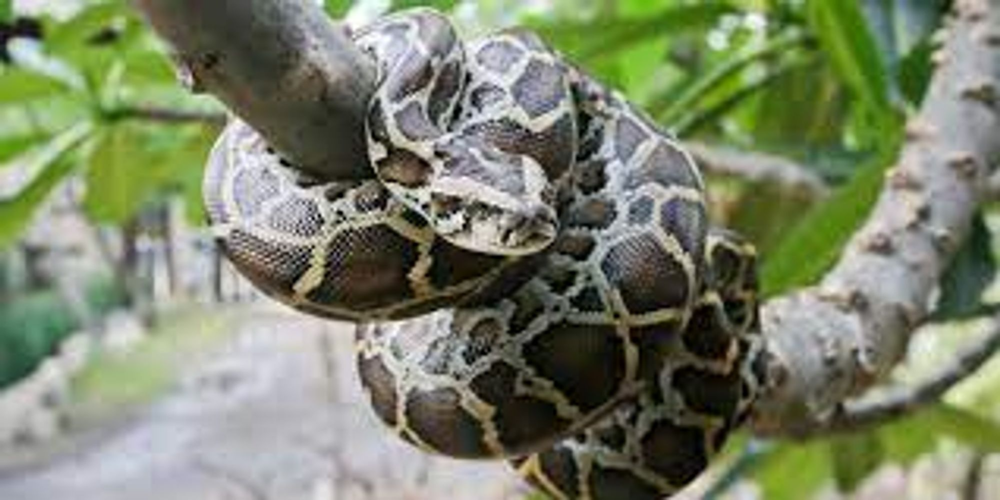

# python - More Classes and Objects

```jsx
__str__ :  """the goal of it is to be readable in other words it is user friendly""""
```

```jsx
__repr__ : """the goal of it is to be unambiguous in other words it is machine friendly generally it is meant for devs"""
```

```jsx
__str__ : """holds the string representation of the object"""
```

```jsx
__repr__ : """holds the object representation in string format"""
```

- ***to call “”__str__””  and “”__repr__”” we use :***

```jsx
str(<object>) :  """the object is the thing that u wanna put inside"""
repr(<object>) : """same thing in here"""
```

- ***what is ‘__del__' ?**

`__del__` is a special method in Python that is called when an object is about to be destroyed. It can be used to perform any cleanup actions before the object is removed from memory. However, it is not recommended to rely on `__del__` for critical cleanup tasks, as it is not guaranteed to be called in all situations where an object is destroyed. Instead, it's better to use a context manager or a `try...finally` block to ensure that cleanup actions are always performed, even in the case of exceptions or other unexpected events.

- ***what is ‘__doc__’ ?***

`__doc__` is another special method in Python that is used to access the docstring of an object. The docstring is a string literal that is the first statement in a module, function, class, or method definition. It is used to document what the code does, how it works, and how it should be used. The `__doc__` method returns the docstring of an object or None if no docstring is defined.

***example :***

```jsx
"""this is a docstring"""
```

***• What is OOP ?***

OOP stands for Object-Oriented Programming. It is a programming paradigm that uses objects to represent and manipulate data and their associated functions. The basic idea behind OOP is to model real-world objects and their relationships using classes and objects. This makes it easier to organize and structure code, as well as to reuse code across different projects. Some of the key concepts in OOP include encapsulation, inheritance, and polymorphism.

***• What is `self` ?***

In Python, `self` refers to the instance of a class that is being manipulated. It is used to access the attributes and methods of the class within its own definition. When a method is called on an object, the object instance is automatically passed as the first argument to the method, which is referred to as `self`. This allows the method to access and manipulate the object's data and behavior.

***• How to use the `getattr` function ?***

The `getattr` function in Python is used to get the value of a named attribute of an object. It takes two arguments: the object whose attribute you want to get, and the name of the attribute as a string. If the attribute exists, `getattr` returns its value. If the attribute does not exist, `getattr` raises an AttributeError. Here is an example of how to use `getattr`:

```
class MyClass:
    def __init__(self):
        self.my_attribute = "Hello, world!"

my_instance = MyClass()

# Get the value of the "my_attribute" attribute
value = getattr(my_instance, "my_attribute")

print(value)  # Output: "Hello, world!"

```

In this example, we create an instance of the `MyClass` class and set its `my_attribute` attribute to the string "Hello, world!". We then use `getattr` to get the value of the `my_attribute` attribute and print it to the console.