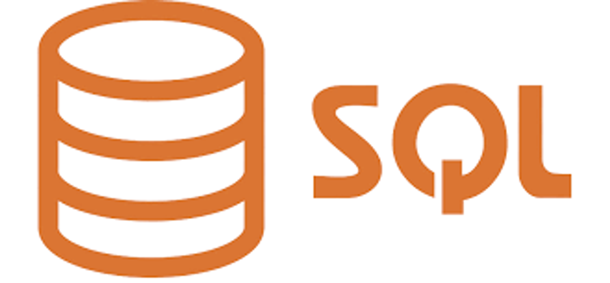
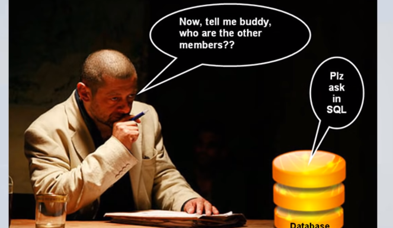
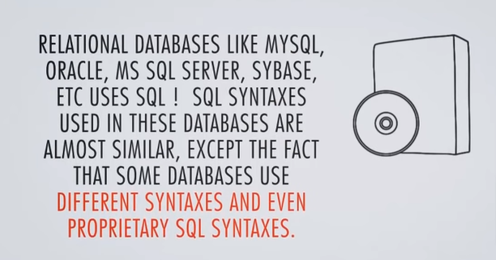
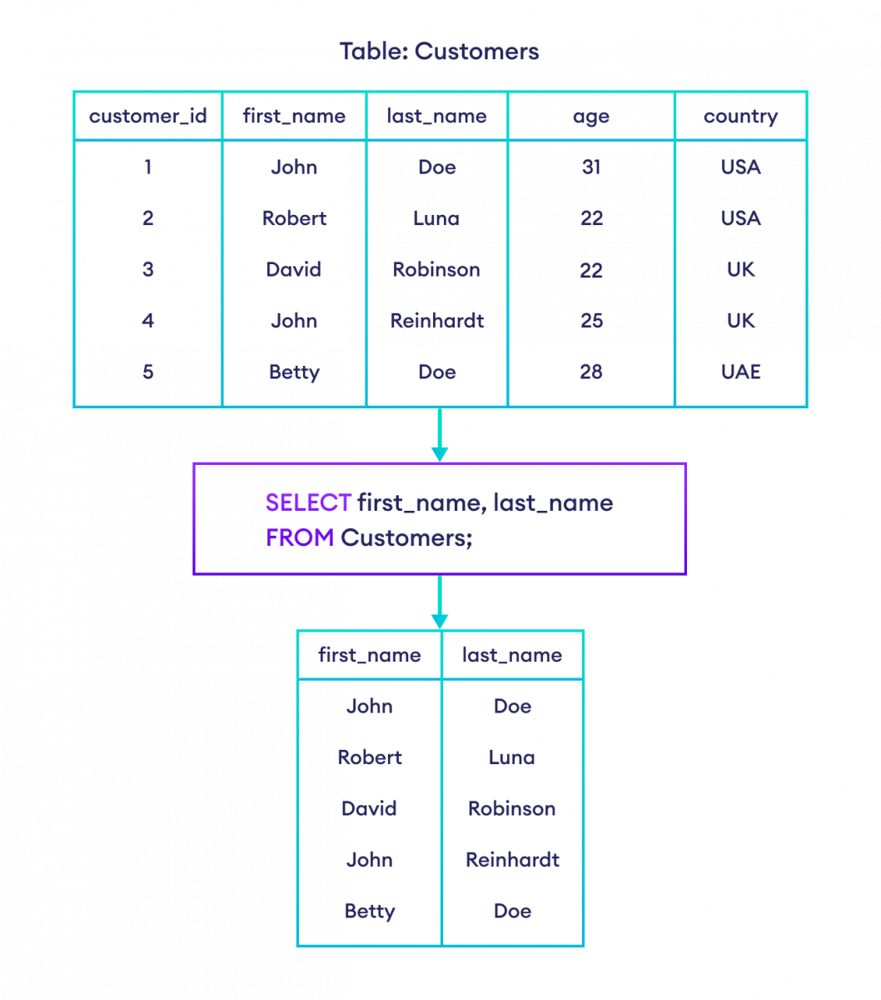

# ***what is data ?***

- in simple words data can be facts related to any objects inconsideration for example :

      your name , age, height, weight, etc …

      are some data related to you a picture , image , file pdf etc can also be considered data .

## ***what is a database management system (DBMS)***

- is a collection of programs which enables its users to access database , manipulate data , & help in representation of data .
- it also helps control access to the database by various users .


## ***what are the types of DBMS :***


***HIERARCHICAL :***

In a hierarchical database management system, data is organized in a tree-like structure with one root and multiple branches, with each branch having one parent and multiple children. This type of DBMS is typically used in large organizations with complex data relationships.

***NETWORK DBMS:***

In a network database management system, data is organized in a more flexible model than the hierarchical model. It allows each record to have multiple parent and child records, creating a web-like structure. This type of DBMS is typically used in engineering and research fields where complex data relationships are common.

***RELATIONAL DBMS:***

In a relational database management system, data is organized into tables, with each table consisting of a set of rows and columns. The columns represent the different data fields, while the rows represent the records. This type of DBMS is the most widely used, as it is highly flexible and can easily handle large amounts of data. It is used in a variety of applications, including finance, healthcare, and e-commerce.

***OBJECT ORIENTED DBMS***

An object-oriented database management system (OODBMS) uses object-oriented programming concepts, like inheritance, encapsulation, and polymorphism, to store and manipulate data. It is used in applications that require complex data types, such as engineering simulations and computer-aided design. OODBMS are highly specialized and are not as commonly used as other types of DBMS.

# ***what is SQL ?***

Structured Query Language (SQL)

- pronounced as Sequel OR SQL is actually the standard language for dealing with Relational Databases .
- it can be effectively used to insert , search , update , delete database records
- it helps in optimizing and maintenance of database and much more .


### **SQL Select syntax**

```sql
SELECT column1, column2, ...
FROM table;
```

Here,

- `column1, column2, ...` are the table columns
- `table` is the table name from where we select the data

For example,

```sql
-- select first_name and last_name columns from Customers table
SELECT first_name, last_name
FROM Customers;
```

[Run Code](https://www.programiz.com/sql/online-compiler)

Here, the SQL command selects the first_name and last_name of all customers in the `Customers` table.


### **SQL SELECT ALL:**

To select all columns from a database table, we use the `*` character. For example,

```sql
-- select all columns from Customers table
SELECT *
FROM Customers;
```

[Run Code](https://www.programiz.com/sql/online-compiler)

**Let's look at another example.**

```sql
-- select age and country columns from customers table where the country is 'USA'
SELECT age, country
FROM Customers
WHERE country = 'USA';
```

[Run Code](https://www.programiz.com/sql/online-compiler)

Here, the SQL command selects the `age` and `country` columns of all the customers whose `country` is **USA**.

> **Note:** In SQL, we must enclose textual data inside either single or double quotations like `'USA'`.
>

# SQL Operators

The `WHERE` clause uses operators to construct conditions. Some of the commonly used operators are:

**1. Equal to Operator (=)**

```sql
-- select all columns from Customers table with first name 'John'
SELECT *
FROM Customers
WHERE first_name = 'John';
```

[Run Code](https://www.programiz.com/sql/online-compiler)

**2. Greater than (>)**

```sql
-- select all columns from Customers table with age greater than 25
SELECT *
FROM Customers
WHERE age > 25;
```

[Run Code](https://www.programiz.com/sql/online-compiler)

**3. AND Operator (AND)**

```sql
-- select all columns from Customers table with last_name 'Doe' and country 'USA'
SELECT *
FROM Customers
WHERE last_name = 'Doe' AND country = 'USA';
```

[Run Code](https://www.programiz.com/sql/online-compiler)

### SQL OR Operator

The SQL `OR` operator selects data if any one condition is `TRUE`. For example,

```sql
-- select first and last name of customers
-- who either live in the USA
-- or have the last name 'Doe'

SELECT first_name, last_name
FROM Customers
WHERE country = 'USA' OR last_name = 'Doe';
```

[Run Code](https://www.programiz.com/sql/online-compiler)

### SQL NOT Operator

The SQL `NOT` operator selects data if the given condition is `FALSE`. For example,

```sql
-- select customers who don't live in the USA

SELECT first_name, last_name
FROM Customers
WHERE NOT country = 'USA';
```

[Run Code](https://www.programiz.com/sql/online-compiler)

### Combining Multiple Operators

It is also possible to combine multiple `AND`, `OR` and `NOT` operators in an SQL statement.

For example, let's suppose we want to select customers where country is either **USA** or **UK**, and age is **less than 26**.

```sql
-- select customers who live in either USA or UK and whose age is less than 26

SELECT *
FROM Customers
WHERE (country = 'USA' OR country = 'UK') AND age < 26;
```

[Run Code](https://www.programiz.com/sql/online-compiler)